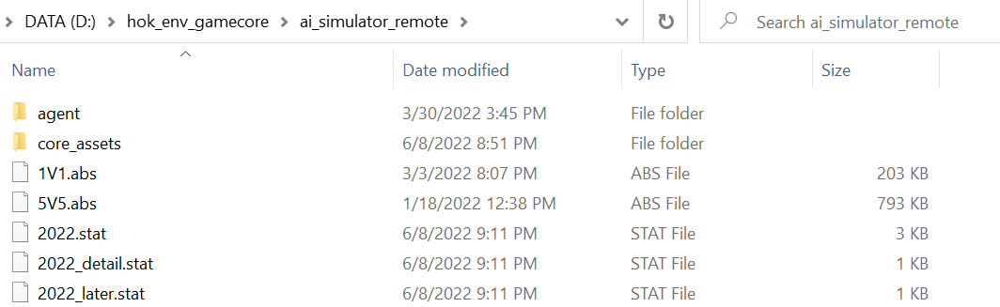

# Honor of Kings AI Open Environment of Tencent(腾讯王者荣耀AI开放环境)


## Update: 3v3 Mode Now Available

```
python3.8 -c "from hok.hok3v3.unit_test.test_env import run_test; run_test()"
```

Please refer to [hok3v3](https://doc.aiarena.tencent.com/paper/hok3v3/latest/hok3v3_env/honor-of-kings/) for further information.

Please consult [cluster.md](docs/cluster.md) document for instructions on cluster training utilizing the `hok_env` environment and the integrated `rl_framework`.

## Introduction

[](https://github.com/tencent-ailab/hok_env/actions/workflows/cpu.yaml)
[](https://github.com/tencent-ailab/hok_env/actions/workflows/gpu.yml)

- [Hok_env](https://github.com/tencent-ailab/hok_env) is the open environment of the MOBA game: [Honor of kings 1V1](https://pvp.qq.com/). 
- This repository mainly includes Hok_env SDK , a reinforcement learning training framework and an implementation of ppo algorithm based on the training framework. Hok_env SDK is used to interact with the gamecore of  Honor of Kings 1v1.
- This repository also contains the implementation code for the paper:
> **Honor of Kings Arena: an Environment for Generalization in Competitive Reinforcement Learning**.\
> Hua Wei*, Jingxiao Chen*, Xiyang Ji*, Hongyang Qin, Minwen Deng, Siqin Li, Liang Wang, Weinan Zhang, Yong Yu, Lin Liu, Lanxiao Huang, Deheng Ye, Qiang Fu, Wei Yang. (*Equal contribution) \
> **NeurIPS Datasets and Benchmarks 2022** \
> Project Page: https://github.com/tencent-ailab/hok_env \
> arXiv: https://arxiv.org/abs/2209.08483

> **Abstract**: *This paper introduces Honor of Kings Arena, a reinforcement learning (RL) environment based on Honor of Kings, one of the world’s most popular games at present. Compared to other environments studied in most previous work, ours presents new generalization challenges for competitive reinforcement learning. It is a multiagent problem with one agent competing against its opponent; and it requires the generalization ability as it has diverse targets to control and diverse opponents to compete with. We describe the observation, action, and reward specifications for the Honor of Kings domain and provide an open-source Python-based interface for communicating with the game engine. We provide twenty target heroes with a variety of tasks in Honor of Kings Arena and present initial baseline results for RL-based methods with feasible computing resources. Finally, we showcase the generalization challenges imposed by Honor of Kings Arena and possible remedies to the challenges. All of the software, including the environment-class, are publicly available at: https://github.com/tencent-ailab/hok_env. The documentation is available at: https://aiarena.tencent.com/hok/doc/.*
- Current supported heroes in hok_env:
  - lubanqihao
  - miyue
  - libai
  - makeboluo (Marco Polo)
  - direnjie
  - guanyu
  - diaochan
  - luna
  - hanxin
  - huamulan
  - buzhihuowu (Mai Shiranui)
  - jvyoujing (Ukyou Tachibana)
  - houyi
  - zhongkui
  - ganjiangmoye
  - kai
  - gongsunli
  - peiqinhu
  - shangguanwaner
### Observation and action spaces
  Please refer to https://aiarena.tencent.com/hok/doc/quickstart/index.html

## Running Requirement

* python 3.6+ (see our test dependencies in env.yaml).
* Windows 10 /11.
* Docker (to deploy Linux containers)
* wsl 2 (Windows Subsystem for Linux Version 2.0)

The gamecore of hok_env runs on the Windows platform, and the package **_hok_env_** needs to be deployed in linux platforms to interact with the gamecore. 
We also provided a docker image for training on your computer. In a further version, we will release a gamecore server compatible with linux.

To enable cluster training, here is a workaround by running Windows gamecore on Linux: [run windows gamecore on linux](./docs/run_windows_gamecore_on_linux.md).

## Installation
### Download the hok gamecore

You need to apply for the license and gamecore on this page: https://aiarena.tencent.com/aiarena/en/open-gamecore

Please put the `license.dat` under the folder:`hok_env_gamecore/gamecore/core_assets` and add the path of the folder `ai_simulator_remote` to the system environment variables.


### Start the gamecore

open CMD
``` shell
 cd gamecore\bin
 set PATH=%PATH%;..\lib\
 .\sgame_simulator_remote_zmq.exe .\sgame_simulator.common.conf
```

sgame_simulator_remote_zmq.exe requires one parameters: config file path

You can see the following message:
```
PlayerNum:2
AbsPath:../scene/1V1.abs
PlayerInfo [CampID:0][HeroID:199][Skill:80104][AutoAi:1][AiServer::0:100] [Symbol 0 0 0] [Request:-1]
PlayerInfo [CampID:1][HeroID:199][Skill:80104][AutoAi:1][AiServer::0:100] [Symbol 0 0 0] [Request:-1]
SGame Simulator Begin
init_ret:0
seed: 3417
Symbols:
inHeroId: 199
0 0 0 0 0 0 0 0 0 0 0 0 0 0 0 0 0 0 0 0 0 0 0 0 0 0 0 0 0 0
0 0 0 0 0 0 0 0 0 0 0 0 0 0 0 0 0 0 0 0 0 0 0 0 0 0 0 0 0 0
inHeroId: 199
0 0 0 0 0 0 0 0 0 0 0 0 0 0 0 0 0 0 0 0 0 0 0 0 0 0 0 0 0 0
0 0 0 0 0 0 0 0 0 0 0 0 0 0 0 0 0 0 0 0 0 0 0 0 0 0 0 0 0 0
start_ret:0
Hero[0] inHeroId:199; outPlayerId:148
Hero[1] inHeroId:199; outPlayerId:149
[Hero Info] [HeroID:199] [RuntimeID:8] client_id:0.0.0.0_1658_0_20221202193534_148
[Hero Info] [HeroID:199] [RuntimeID:9] client_id:0.0.0.0_1658_0_20221202193534_149
boost_ret finished: 8, gameover_ai_server: 0
close_ret:0
uninit_ret:0
SGame Simulator End [FrameNum:8612][TimeUsed:7580ms]
```
The gamecore has started successfully!

---

`sgame_simulator.common.conf`:
```angular2html
{
    "abs_file": "../scene/1V1.abs",
    "core_assets": "../core_assets",
    "game_id": "kaiwu-base-35401-35400-6842-1669963820108111766-217",
    "hero_conf": [
        {
            "hero_id": 199
        },
        {
            "hero_id": 199
        }
    ]
}
```

output files:
```
AIOSS_221202-1935_linux_1450111_1450123_1_1_20001_kaiwu-base-35401-35400-6842-1669963820108111766-217.abs
kaiwu-base-35401-35400-6842-1669963820108111766-217.json
kaiwu-base-35401-35400-6842-1669963820108111766-217.stat
kaiwu-base-35401-35400-6842-1669963820108111766-217_detail.stat
```


### Test the gamecore with the demo script in WSL
You can test gamecore with a simple python script in wsl.

#### Make sure your pc supports wsl2
For the installation and upgrade of wsl2, please refer to the link: https://docs.microsoft.com/zh-cn/windows/wsl/install-manual#step-4---download-the-linux-kernel-update-package`

You need to install python3.6 and some required dependencies in wsl.

#### Run the test script in wsl2

0. Start the gamecore server outside wsl2
```
cd gamecore
gamecore-server.exe server --server-address :23432
```
1. Install hok_env in python
```
## after git clone this repo 
cd hok_env/hok_env
pip install -e .
```
2. Run the test script
```angular2html
cd /hok_env/hok/hok1v1/unit_test
python test_env.py
```
If you see the following message, you have successfully established a connection with Hok_env and have completed a game. Congratulations!
```
# python test_env.py
127.0.0.1:23432 127.0.0.1
======= test_send_action
camp_config {'mode': '1v1', 'heroes': [[{'hero_id': 132}], [{'hero_id': 133}]]}
common_ai [False, True]
try to get first state...
first state:  dict_keys(['observation', 'legal_action', 'reward', 'done', 'model_output_name', 'game_id', 'player_id', 'frame_no', 'sub_action_mask', 'req_pb', 'sgame_id'])
first frame: 0
----------------------run step  0
----------------------run step  100
----------------------run step  200
----------------------run step  300
----------------------run step  400
----------------------run step  500
----------------------run step  600
----------------------run step  700
----------------------run step  800
----------------------run step  900
----------------------run step  1000
----------------------run step  1100
2023-08-23 13:13:57.782 | INFO     | hok.common.log:info:85 - game not end, send close game at first: cur_frame_no(3525)
[{
    "player_id": 8,
    "frame_no": 30,
    "observation": array([1.00000000e00, 1.00000000e00, 0.00000000e00, 0.00000000e00, ...]),
    "reward": (0.0, 0.0, 0.0, 0.0, 0.0, 0.0, 0.0, 0.0, 0.0),
    "legal_action": array([1.0, 1.0, 1.0, 0.0, 0.0, ...]),
    "sub_action_mask": {
        0: array([1.0, 0.0, 0.0, 0.0, 0.0, 0.0]),
        1: array([1.0, 0.0, 0.0, 0.0, 0.0, 0.0]),
        ...
        11: array([1.0, 0.0, 0.0, 0.0, 0.0, 0.0]),
    },
    "req_pb": hok.hok1v1.lib.interface.AIFrameState,
}, ...]
```

## Modify Game Config
Before running the game Env, you need to create file `config.json` at the running path.

An example:
```json
{
  "reward_money": "0.006",
  "reward_exp": "0.006" ,
  "reward_hp_point": "2.0",
  "reward_ep_rate": "0.75",
  "reward_kill": "-0.6",
  "reward_dead": "-1.0",
  "reward_tower_hp_point": "5.0",
  "reward_last_hit": "0.5",
  
  "log_level": "4"
}
```
This config file includes sub-reward factors and log_level of protobuf processing part. 
The file is only loaded when creating instances of `HoK1v1`, 
and any modifications would not be reloaded even if you call `HoK1v1.reset`.

In most cases, log_level should be set as `4` to avoid useless log information. 
Only if you meet some error when using our environment, `log_level` may need a 
lower value to help us get more information about the error your meet.

## Replay Tool
Watching the game is a direct way to see the performance of your agent throughout a match. We provide a replay tool to visualize the matches.

### Replay software: ABS Parsing Tool (will be provided along with the gamecore in the reply email)
This is an official replay software which parses the ABS file generated by the gamecore and outputs the videos in the game UI of Honor of Kings. The ABS file generated by the gamecore could be found under the folder ai_simulator_remote (the gamecore path). 
You can visualize the matches by putting  ABS files under the `Replays` folder and running **ABSTOOL.exe**.


## Pre-built image

https://hub.docker.com/r/tencentailab/hok_env

See also: [run_with_prebuilt_image](./docs/run_with_prebuilt_image.md)

## Install from PyPI

```
pip install hok
```

## Citation
If you use the gamecore of hok_env or the code in this repository, please cite our paper as follows.
```
@inproceedings{wei2022hok_env,
  title={Honor of Kings Arena: an Environment for Generalization in Competitive Reinforcement Learning},
  author={Wei, Hua and Chen, Jingxiao and Ji, Xiyang and Qin, Hongyang and Deng, Minwen and Li, Siqin and Wang, Liang and Zhang, Weinan and Yu, Yong and Liu, Lin and Huang, Lanxiao and Ye, Deheng and Fu, Qiang and Yang, Wei},
  booktitle={Proceedings of the Neural Information Processing Systems Track on Datasets and Benchmarks},
  year={2022}
}
```
